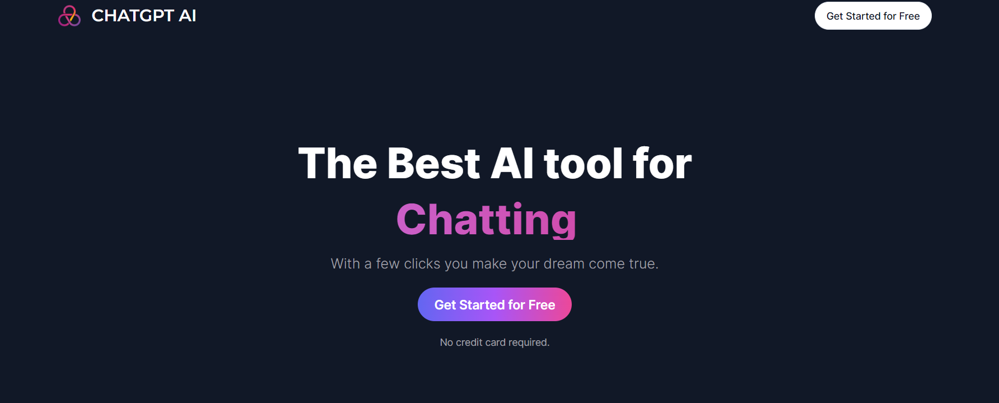

# AI-Platform

Dashboard Page (app/(dashboard)/(routes)/dashboard/page.tsx):
This page provides a dashboard for users to explore various AI tools. The tools available are:

Conversation
Image Generation
Video Generation
Music Generation
Code Generation
Each tool has an associated icon and a link to its respective page. The dashboard provides a brief introduction about the capabilities of the AI and lists the tools in a card format.

2. Sign-In Page (app/(auth)/(routes)/sign-in/[[...sign-in]]/page.tsx):
This is a simple sign-in page that uses the @clerk/nextjs package for authentication.

3. Landing Hero Component (components/landing-hero.tsx):
This component is likely displayed prominently on the landing page. It introduces the platform as "The Best AI tool" and uses a typewriter effect to cycle through various use-cases like Chatting, Code Generation, Image Generation, Video Generation, and Music Generation. There's also a call-to-action button prompting users to get started for free.

4. Navbar Component (components/navbar.tsx):
The navbar component contains a mobile sidebar and a user button for authentication. It also checks for the user's API limit and subscription status.

5. Code API Route (app/api/code/route.ts):
This API route is designed to handle code generation requests. It uses the OpenAI API for generating code based on user input. The system message instructs the AI to generate code in markdown format and use comments for explanations. The API checks for user authentication, OpenAI API key configuration, and message input. It also checks if the user has exceeded their free trial limit or if they have a Pro subscription.

6. Conversation API Route (app/api/conversation/route.ts):
Similar to the code API route, this route handles conversation requests with the AI. It uses the OpenAI API to generate conversation based on user input. The route checks for user authentication, OpenAI API key configuration, and message input. It also checks the user's free trial limit and subscription status.

7. PrismaDB Configuration (lib/prismadb.ts):
The platform uses Prisma as its ORM. This file sets up and exports the Prisma client for database operations.

8. Stripe Configuration (lib/stripe.ts):
The platform integrates with Stripe for payment processing. This file sets up and exports the Stripe client with the appropriate API version.

